# Aegis (Software MRI) - Project Analysis

## Title Evaluation

**Current Title:** "Software MRI · RepoLens AI"

**Proposed Title:** "Aegis"

### Assessment:
The current title **"Software MRI"** is **SUPERIOR** to "Aegis" for the following reasons:

1. **Immediate Clarity**: "Software MRI" instantly communicates the core value proposition - scanning and visualizing internal software structure, just like medical MRI scans reveal internal body structures
2. **Memorable Metaphor**: The medical imaging analogy is powerful and resonates with the target audience (CTOs, architects, modernization teams)
3. **Self-Documenting**: The name explains what the product does without additional context
4. **Market Positioning**: Positions the tool as diagnostic/observability rather than just another code analysis tool

**"Aegis"** (meaning shield/protection) is:
- Generic and doesn't convey the product's purpose
- Requires explanation - what does it protect? How?
- Less memorable in a crowded developer tools market
- Doesn't differentiate from competitors

**Recommendation:** **Keep "Software MRI"** as the primary brand. "Aegis" could work as a codename or internal project identifier, but "Software MRI" is the stronger market-facing name.

---

## Repository Map

```
software-mri/
│
├── backend/                          # Python FastAPI backend
│   ├── main.py                       # Application entrypoint, startup logic
│   ├── requirements.txt              # Python dependencies
│   │
│   ├── analyzer/                     # Deterministic analysis engine
│   │   ├── __init__.py
│   │   ├── scanner.py                # Repository file discovery
│   │   ├── ast_parser.py             # Python AST parsing, extract imports/functions
│   │   ├── graph_builder.py          # NetworkX dependency graph construction
│   │   ├── blast_radius.py           # Impact analysis (transitive dependencies)
│   │   ├── tech_debt.py              # Technical debt scoring (complexity, coupling, cycles)
│   │   └── flow_tracer.py            # Execution flow reconstruction from queries
│   │
│   ├── bob/                          # IBM Bob AI integration layer
│   │   ├── __init__.py
│   │   ├── client.py                 # Bob API client with fallback logic
│   │   └── prompts.py                # Task-specific prompt templates
│   │
│   ├── api/                          # REST API layer
│   │   ├── __init__.py
│   │   ├── routes.py                 # FastAPI endpoints
│   │   └── schemas.py                # Pydantic request/response models
│   │
│   └── tests/
│       └── test_analyzer.py          # Unit tests for analyzer components
│
├── frontend/                         # React + Vite frontend
│   ├── index.html                    # HTML entry point
│   ├── package.json                  # Node dependencies
│   ├── package-lock.json
│   ├── vite.config.js                # Vite build configuration
│   │
│   └── src/
│       ├── main.jsx                  # React app bootstrap
│       ├── App.jsx                   # Main application component
│       │
│       ├── api/
│       │   └── client.js             # Backend API client
│       │
│       ├── components/
│       │   ├── Header.jsx            # Top navigation bar
│       │   ├── Sidebar.jsx           # Module list sidebar
│       │   ├── ArchitectureGraph.jsx # vis-network graph visualization
│       │   ├── BlastRadiusPanel.jsx  # Impact analysis display
│       │   ├── TechDebtPanel.jsx     # Debt heatmap and hotspots
│       │   └── QueryPanel.jsx        # Natural language query interface
│       │
│       └── styles/
│           └── main.css              # Application styles
│
├── sample-repo/                      # Demo legacy banking system
│   ├── core/                         # Core utilities (database, utils)
│   ├── auth/                         # Authentication (users, sessions)
│   ├── billing/                      # Billing logic (invoices, tax)
│   ├── payments/                     # Payment processing (processor, validator, fraud)
│   ├── reporting/                    # Reporting (audit, financial)
│   └── legacy/                       # Legacy code (COBOL bridge, old gateway)
│
├── docs/                             # Documentation
│   ├── PROJECT_BRIEF.md              # Problem statement and thesis
│   ├── ARCHITECTURE.md               # Technical architecture
│   ├── BOB_INTEGRATION.md            # IBM Bob integration details
│   ├── DEMO_SCRIPT.md                # Demo walkthrough
│   └── HACKATHON_NOTES.md            # Submission notes
│
├── scripts/                          # Automation scripts
│   ├── setup.sh                      # One-shot environment setup
│   ├── run-backend.sh                # Start FastAPI server
│   └── run-frontend.sh               # Start Vite dev server
│
├── .env.example                      # Environment configuration template
├── .gitignore
└── README.md                         # Project overview
```

---

## Dependencies Analysis

### Backend Dependencies (Python)
```
fastapi==0.115.0          # Web framework
uvicorn[standard]==0.30.6 # ASGI server
pydantic==2.9.2           # Data validation
python-dotenv==1.0.1      # Environment configuration
networkx==3.3             # Graph algorithms (CRITICAL)
httpx==0.27.2             # Async HTTP client for Bob
```

### Frontend Dependencies (JavaScript)
```
react@^18.3.1             # UI framework
react-dom@^18.3.1         # React DOM renderer
vis-network@^9.1.9        # Graph visualization (CRITICAL)
vis-data@^7.1.9           # Data structures for vis-network
vite@^5.4.1               # Build tool and dev server
@vitejs/plugin-react@^4.3.1 # React plugin for Vite
```

### External Dependencies
- **IBM Bob**: AI partner for code explanation and modernization planning
- **Python 3.11+**: Runtime environment
- **Node.js**: Frontend build tooling

---

## Bottleneck Analysis

### 1. **IBM Bob API Calls** (CRITICAL BOTTLENECK)
- **Location**: [`backend/bob/client.py`](../backend/bob/client.py)
- **Impact**: Bob calls are synchronous and can take 5-60 seconds
- **Mitigation**: 
  - Deterministic fallbacks implemented
  - Results should be cached in frontend state
  - Consider implementing response streaming

### 2. **AST Parsing at Scale**
- **Location**: [`backend/analyzer/ast_parser.py`](../backend/analyzer/ast_parser.py)
- **Impact**: Parsing 2000+ files can take 10-30 seconds on startup
- **Mitigation**:
  - MAX_FILES limit set to 2000
  - Could implement incremental parsing
  - Consider background re-analysis on file changes

### 3. **Graph Algorithms**
- **Location**: [`backend/analyzer/blast_radius.py`](../backend/analyzer/blast_radius.py), [`backend/analyzer/graph_builder.py`](../backend/analyzer/graph_builder.py)
- **Impact**: Transitive closure computation is O(n²) worst case
- **Mitigation**:
  - NetworkX is optimized for this
  - Results are computed once at startup
  - Could cache blast radius results

### 4. **Frontend Graph Rendering**
- **Location**: [`frontend/src/components/ArchitectureGraph.jsx`](../frontend/src/components/ArchitectureGraph.jsx)
- **Impact**: vis-network struggles with >1000 nodes
- **Mitigation**:
  - Currently limited to sample repo size
  - Production would need graph clustering/filtering
  - Consider hierarchical visualization

### 5. **Single-Tenant In-Memory State**
- **Location**: [`backend/main.py`](../backend/main.py) - `AppState` class
- **Impact**: Only one repository can be analyzed at a time
- **Mitigation**:
  - Acceptable for hackathon/demo
  - Production needs multi-tenant architecture
  - Consider Redis/Neo4j for persistent storage

---

## Short Description

**Software MRI** is an AI-powered repository cognition platform that transforms legacy codebases into observable operational structures. It combines deterministic static analysis with IBM Bob's AI capabilities to provide architecture graphs, blast-radius prediction, technical debt heatmaps, and modernization intelligence—turning "nobody fully understands this anymore" into actionable architectural insights.

---

## Long Description

### Overview
Software MRI (RepoLens AI) is a revolutionary architectural observability platform designed to solve the most critical bottleneck in enterprise modernization: understanding what legacy code actually does without breaking compliance, business logic, or institutional knowledge.

### The Problem
Most enterprise modernization projects take 2-10 years. The bottleneck isn't writing new code—it's understanding decades-old, mission-critical, undocumented systems that process billions of dollars reliably but that "nobody fully understands anymore." Current tools provide code search and static diagrams but lack a true cognition layer for software architecture.

### The Solution
Software MRI performs a comprehensive "MRI scan" of software repositories, revealing:

1. **Architecture Graphs**: Complete dependency visualization with every module, import relationship, and domain boundary color-coded and interactive
2. **Blast Radius Analysis**: Predictive impact assessment showing exactly what breaks when you modernize any component
3. **Technical Debt Heatmaps**: Quantified scoring of complexity, coupling, cyclic dependencies, and legacy code fragility
4. **Execution Flow Tracing**: Natural language queries like "how does authentication work?" answered with step-by-step flow narratives
5. **Modernization Intelligence**: AI-generated safe migration plans with ordered extraction sequences and risk tradeoffs
6. **Institutional Knowledge Recovery**: Automated discovery of hidden business rules, regulatory branches, and undocumented assumptions buried in legacy code

### Architecture Philosophy
**Deterministic Analysis First, AI Explanation Second**

The platform uses a hybrid approach:
- **Deterministic Layer**: Python AST parsing, NetworkX graph algorithms, and static analysis find the structure
- **AI Layer**: IBM Bob reads the structured context and explains it in plain English, narrates flows, and recommends modernization strategies

This design ensures:
- **Speed**: Bob only processes small, high-signal subgraphs
- **Reliability**: No AI hallucination about which files call which
- **Cost-Efficiency**: Smaller, focused prompts
- **Robustness**: Deterministic fallbacks keep the system functional even without Bob

### IBM Bob Integration
Bob is integrated at four critical points:
1. **Module Summarization**: Reads code + neighbors to produce business-level explanations
2. **Flow Narration**: Converts graph traces into step-by-step execution narratives
3. **Modernization Planning**: Multi-step reasoning over risk metrics to generate ordered migration plans
4. **Hidden Logic Recovery**: Surfaces implicit business rules and institutional knowledge

### Target Users
- **Enterprise Architects**: Planning modernization of legacy systems
- **Engineering Leaders**: Understanding technical debt and risk
- **New Team Members**: Onboarding to complex codebases
- **Modernization Consultants**: Assessing migration complexity

### Current Capabilities
- Python repository analysis (AST-based, works on any Python codebase)
- Real-time dependency graph visualization with vis-network
- Computed blast radius, cycle detection, and debt metrics
- Natural language query interface powered by IBM Bob
- Sample legacy banking system demonstrating realistic complexity

### Future Roadmap
- Multi-language support (Java, JavaScript, COBOL)
- IDE plugins (VS Code, IntelliJ)
- Persistent storage (Neo4j graph database)
- Multi-tenant SaaS architecture
- Real-time analysis on git push
- Compliance and security rule detection

---

## Technology Stack

### Backend
| Technology | Version | Purpose |
|------------|---------|---------|
| **Python** | 3.11+ | Runtime environment |
| **FastAPI** | 0.115.0 | Modern async web framework |
| **Uvicorn** | 0.30.6 | ASGI server with WebSocket support |
| **Pydantic** | 2.9.2 | Data validation and serialization |
| **NetworkX** | 3.3 | Graph algorithms and analysis |
| **httpx** | 0.27.2 | Async HTTP client for Bob integration |
| **python-dotenv** | 1.0.1 | Environment configuration |

### Frontend
| Technology | Version | Purpose |
|------------|---------|---------|
| **React** | 18.3.1 | UI framework |
| **Vite** | 5.4.1 | Build tool and dev server |
| **vis-network** | 9.1.9 | Interactive graph visualization |
| **vis-data** | 7.1.9 | Data structures for vis-network |

### AI Integration
| Technology | Purpose |
|------------|---------|
| **IBM Bob** | AI development partner for code explanation, flow narration, and modernization planning |

### Analysis Techniques
- **Abstract Syntax Tree (AST) Parsing**: Python's built-in `ast` module
- **Static Analysis**: Import extraction, function/class detection
- **Graph Theory**: Dependency graphs, transitive closure, cycle detection
- **Complexity Metrics**: Branch counting, LOC analysis
- **Coupling Analysis**: In-degree/out-degree centrality

### Development Tools
- **Bash Scripts**: Automation for setup and execution
- **Git**: Version control
- **Environment Variables**: Configuration management

---

## Pipeline Flow Diagram

```mermaid
graph TB
    Start([User Points Tool at Repository]) --> Scan[Scanner: Walk Directory Tree]
    
    Scan --> Parse[AST Parser: Extract Imports & Functions]
    
    Parse --> Graph[Graph Builder: Create NetworkX DiGraph]
    
    Graph --> Parallel{Parallel Analysis}
    
    Parallel --> Blast[Blast Radius: Transitive Closure]
    Parallel --> Debt[Tech Debt: Complexity Scoring]
    Parallel --> Flow[Flow Tracer: Query Matching]
    
    Blast --> Store[(In-Memory State)]
    Debt --> Store
    Flow --> Store
    Graph --> Store
    
    Store --> API[FastAPI REST Endpoints]
    
    API --> Frontend[React Frontend]
    
    Frontend --> Viz{User Action}
    
    Viz -->|View Graph| GraphVis[vis-network Visualization]
    Viz -->|Click Module| BlastPanel[Blast Radius Panel]
    Viz -->|View Debt| DebtHeatmap[Tech Debt Heatmap]
    Viz -->|Ask Question| QueryFlow[Natural Language Query]
    
    QueryFlow --> BobDecision{Bob Available?}
    BlastPanel --> BobDecision2{Need Modernization Plan?}
    
    BobDecision -->|Yes| BobAPI[IBM Bob API]
    BobDecision -->|No| Fallback[Deterministic Fallback]
    
    BobDecision2 -->|Yes| BobAPI
    BobDecision2 -->|No| Display[Display Results]
    
    BobAPI --> BobTasks{Bob Task Type}
    
    BobTasks -->|Explain Module| Prompt1[PROMPT_EXPLAIN_MODULE]
    BobTasks -->|Flow Query| Prompt2[PROMPT_FLOW_QUERY]
    BobTasks -->|Modernization| Prompt3[PROMPT_MODERNIZATION]
    BobTasks -->|Hidden Logic| Prompt4[PROMPT_HIDDEN_LOGIC]
    
    Prompt1 --> BobResponse[Bob Response]
    Prompt2 --> BobResponse
    Prompt3 --> BobResponse
    Prompt4 --> BobResponse
    
    BobResponse --> Display
    Fallback --> Display
    GraphVis --> Display
    
    Display --> End([User Insights])
    
    style Start fill:#e1f5ff
    style End fill:#e1f5ff
    style BobAPI fill:#ffeb99
    style Store fill:#ffe6e6
    style API fill:#e6ffe6
    style Frontend fill:#f0e6ff
```



### Pipeline Stages Explained

#### 1. **Repository Ingestion**
- **Scanner** ([`scanner.py`](../backend/analyzer/scanner.py)): Recursively walks directory, filters Python files, respects ignore patterns
- **Output**: List of absolute file paths

#### 2. **Static Analysis**
- **AST Parser** ([`ast_parser.py`](../backend/analyzer/ast_parser.py)): Parses each file's AST, extracts imports, functions, classes, complexity
- **Output**: Dictionary of Module objects with metadata

#### 3. **Graph Construction**
- **Graph Builder** ([`graph_builder.py`](../backend/analyzer/graph_builder.py)): Creates NetworkX DiGraph with nodes (modules) and edges (imports)
- **Output**: Directed dependency graph

#### 4. **Parallel Analysis** (All use the graph)
- **Blast Radius** ([`blast_radius.py`](../backend/analyzer/blast_radius.py)): Computes transitive dependencies, risk scores
- **Tech Debt** ([`tech_debt.py`](../backend/analyzer/tech_debt.py)): Scores complexity, coupling, cycles, legacy markers
- **Flow Tracer** ([`flow_tracer.py`](../backend/analyzer/flow_tracer.py)): Keyword matching + BFS for query answering

#### 5. **State Management**
- **AppState** ([`main.py`](../backend/main.py)): In-memory singleton holding graph, modules, debt scores, Bob client

#### 6. **API Layer**
- **FastAPI Routes** ([`routes.py`](../backend/api/routes.py)): REST endpoints for graph, blast, debt, query, modernization

#### 7. **Frontend Visualization**
- **React Components**: Interactive graph, panels, query interface
- **vis-network**: Physics-based graph layout and rendering

#### 8. **AI Enhancement**
- **Bob Integration** ([`client.py`](../backend/bob/client.py)): Calls IBM Bob for explanations, narrations, planning
- **Fallback Logic**: Deterministic responses when Bob unavailable

---

## Key Insights

### Strengths
1. **Hybrid Architecture**: Deterministic analysis + AI explanation is the right pattern
2. **Clear Separation**: Analysis layer is independent of AI layer
3. **Robust Fallbacks**: System works without Bob
4. **Real Analysis**: Not faked—actual AST parsing and graph algorithms
5. **Focused Bob Usage**: Small, high-signal prompts maximize quality

### Weaknesses
1. **Python-Only**: Limited to Python repositories currently
2. **Scalability**: In-memory state limits to ~2000 files
3. **Single-Tenant**: One repo at a time
4. **Graph Rendering**: vis-network struggles at scale
5. **No Persistence**: Analysis lost on restart

### Opportunities
1. **Multi-Language**: Extend to Java, JavaScript, COBOL
2. **IDE Integration**: VS Code extension for inline insights
3. **Continuous Analysis**: Git hooks for real-time updates
4. **Enterprise Features**: Auth, multi-tenant, audit logs
5. **Advanced Metrics**: Security vulnerabilities, compliance rules

---

## Conclusion

**Software MRI** is a well-architected, production-ready prototype that solves a genuine enterprise problem. The name is strong, the technology choices are sound, and the IBM Bob integration is meaningful and non-cosmetic. The hybrid deterministic + AI approach is the correct pattern for this domain and positions the product for long-term success in the enterprise modernization market.